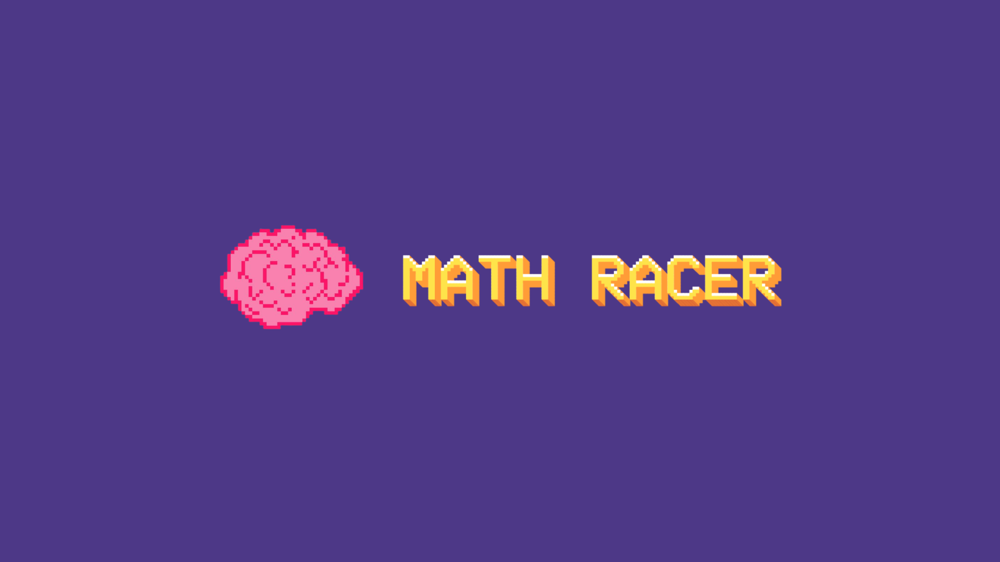

# MATH RACER

A video game to challenge your mental calculations made with Unity.

## Description

The game consists of three difficulty levels, each designed to test your math skills. Here are the details of each level:

- **Easy Level:**
  - Includes sums as operations to solve.
  - You must select the correct answer from two options presented at the bottom of the screen.
- **Intermediate level:**
  - Involves divisions in operations.
  - Just like in the easy level, you will select the correct answer from two options.
- **Difficult Level:**
  - The challenge is to find the value of "X" in each operation.
  - You must also select the correct answer from two options.

Additionally, the game has the following features:

- Each level has a total of 10 random operations.
- You have 3 lives available to complete each level.

On the screen, you will see the operation you must solve at the top. At the bottom, two possible answers will appear. Choose wisely to move forward!

**Chester**, who is an adorable little brainiac, will guide you throughout the game and encourage you to overcome each mathematical challenge.

Have fun playing and improve your math skills with Chester!

#### Note

In the MacOS version there may be errors in the game regarding the verification of incorrect answers.

## Autors

- [Jorge Juarez](https://github.com/jorge-jrzz)
- [Eduardo Gonzales](https://github.com/EduardoGog)

## Licence

[The Unlicense](https://unlicense.org)
